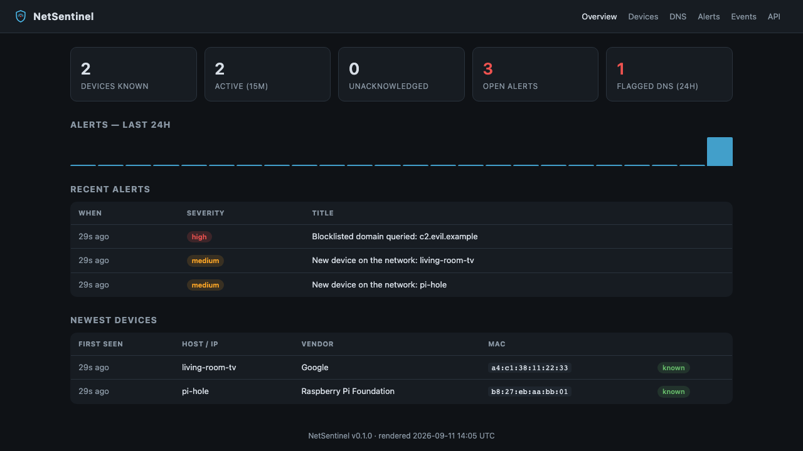

<p align="center"></p>
<h1 align="center">NetSentinel</h1>

Elimde boşta duran birkaç Raspberry Pi vardı, onları değerlendirmek için
yazdığım bir ev ağı güvenlik izleyicisi. Bir cihaz ağı dinliyor, diğeri
geçmişi tutup tarayıcıdan sana gösteriyor.

*[English README is here](README.md).*



İki Pi ile de tek Pi ile de çalışır. Aklımdaki üç soruya cevap vermesi için
tasarladım - bunun için bulut servisine para ödemek ya da evdeki her cihaza
ayrı ayrı ajan kurmak istemedim:

1. **Ağımda gerçekten kim var?** Yeni bir cihaz belirdiğinde MAC üreticisi
   çözülür ve sana haber verilir.
2. **Ağım kiminle konuşuyor?** Pasif DNS kaydı tutulur, bir blocklist'e karşı
   kontrol edilir, istersen şüpheli IP'ler için AbuseIPDB sorgusu da eklenir.
3. **Dünden bugüne ne değişti?** Kendi alt ağında zamanlanmış `nmap`
   taramaları, yeni açılan bir portu sen fark etmeden önce haber verir.

Bir zenginleştirme API anahtarı ya da push bildirim ayarlamadığın sürece
hiçbir şey ev ağından dışarı çıkmaz. İçinde eve telefon eden bir telemetri
yok.

Tarama sadece `NETSENTINEL_LOCAL_SUBNET` ile belirttiğin aralıkla sınırlı -
onun dışına çıkmaz. Bu, sahibi olduğun ya da yönettiğin bir ağ için; başkasının
Wi-Fi'sini karıştırmak için değil.

---

## Nasıl kurgulandı

```
        ┌─────────────────────────┐          ┌──────────────────────────────┐
        │  Pi #1  -  sensör       │  HTTPS   │  Pi #2  -  hub               │
        │                         │  Bearer  │                              │
        │  • ARP/NDP keşfi        │ ───────► │  • FastAPI  /api/*           │
        │  • pasif DNS (scapy)    │  /api/   │  • ingest hattı + kurallar   │
        │  • zamanlanmış nmap     │  ingest  │  • SQLite (WAL)              │
        │  • toplu gönderim       │          │  • panel (Jinja2)            │
        │                         │          │  • bildirim: ntfy/TG/webhook │
        └─────────────────────────┘          │  • APScheduler bakımı        │
                                             └──────────────────────────────┘
```

İki taraf da aynı Python paketi (`netsentinel`); bir systemd unit'i ya da bir
ortam değişkeni (`NETSENTINEL_ROLE`) hangisinin ne olacağına karar veriyor.
Ben genelde ayrı kartlarda çalıştırıyorum ki sensör switch'e daha yakın
dursun, ama tek Pi'de ikisini birden çalıştırmana da hiçbir engel yok -
aşağıda anlatıyorum.

Veri modeli ve algılama kuralları [`docs/ARCHITECTURE.md`](docs/ARCHITECTURE.md)
içinde, detay istersen oraya bakabilirsin.

---

## Gerekli donanım

Ben 2'şer GB'lık iki Raspberry Pi 4B ve birer 64 GB kartla çalıştırıyorum ama
aslında bu kadarına ihtiyaç yok.

### Role göre kart seçimi

| Kurulum | Asgari | Benim tercihim | Gerçek RAM kullanımı |
|---|---|---|---|
| sadece hub | Pi 3B / Zero 2 W, 512 MB boş | Pi 4B 2 GB | ~90–140 MB |
| sadece sensör | Zero 2 W / Pi 3B, kablolu ağ | Pi 4B 2 GB | ~60–110 MB (scapy asıl yükü çekiyor) |
| tek Pi'de ikisi | Pi 3B, 1 GB | Pi 4B 2 GB | ~150–250 MB toplam |
| daha fazla sensör | 1 hub + istediğin kadar sensör | daha güçlü bir hub kartı | tek hub, birden çok sensör |

3B'den yukarısı sorunsuz çalışır. Zero 2 W sensörü kaldırır ama hub'ı
oraya koymazdım. Üst sınır yok - daha güçlü bir kart sadece daha uzun geçmiş
ve daha büyük blocklist'ler demek.

### SD kart

8 GB alt sınır (işletim sistemi imajı tek başına ~2.5 GB). 16–32 GB alırdım,
ya da SD kart aşınmasından çekiniyorsan veri dizinini bir USB SSD'ye
yönlendir. Varsayılan saklama ayarlarında veritabanı ayda 50–150 MB civarı
büyüyor, yani 64 GB'lık bir kart uzun süre yeter.

### Kurulu olması gerekenler

- Raspberry Pi OS Lite, 64-bit, Bookworm - Python 3.11 zaten geliyor.
  32-bit de çalışır, Pi üzerinde Ubuntu Server da olur.
- Sadece sensörde `nmap` (`sudo apt install nmap`). Hub'ın ihtiyacı yok.
- Sensörün paket yakalayabilmesi için `CAP_NET_RAW` + `CAP_NET_ADMIN` yeterli
  - systemd unit'i tam root değil, sadece bu yetkileri veriyor.
- Mümkünse sensörde kablolu ağ. Wi-Fi genelde sadece kendi trafiğini ve
  broadcast'leri görür, bu da pasif DNS'in amacını boşa çıkarır.

### Diğer cihazların DNS trafiğini gerçekten görmek

Bu ilk kurulumda beni de şaşırtmıştı, o yüzden ayrıca yazıyorum: sensör sadece
kendi ağ arayüzüne ulaşan paketleri görür. Sırasıyla, en çok göreceğinden en
aza doğru:

1. Switch'te bir mirror/SPAN portu, sensörün arayüzüne bağlı - en iyisi.
2. Sensörü doğrudan router üzerinde çalıştırmak.
3. Router'ın DHCP ile duyurduğu DNS sunucusunu sensörün IP'sine çevirmek -
   sadece DNS görürsün ama ağdaki her cihazdan.
4. Mirror kurmadan devam etmek - yine de cihaz keşfi ve port değişikliği
   tespiti çalışır, sadece başka cihazların DNS sorgularını göremezsin.

---

## Çalıştırma seçenekleri

### İki Pi (benim kullandığım kurulum)

```
 Pi #1  "pi-sensor"                     Pi #2  "pi-hub"
 NETSENTINEL_ROLE=sensor  ──HTTPS/Bearer──►  NETSENTINEL_ROLE=hub
 keşif · pasif DNS · nmap               API + panel :8080
```

Laptop'undan:

```bash
git clone https://github.com/gorkemguler/net-sentinel.git
cd net-sentinel/deploy/ansible
cp inventory.example.ini inventory.ini     # iki Pi'nin IP'si, bir token, kendi alt ağın
ansible-playbook -i inventory.ini site.yml
```

Bu kadar - paketi her iki kutuya da kuruyor, `/etc/netsentinel/netsentinel.env`
dosyasını bırakıyor, bir Pi'de `netsentinel-hub`'ı diğerinde `netsentinel-sensor`'ı
etkinleştiriyor. Panel `http://<hub-pi>:8080/` adresinde. Elle yapmak
istersen [`docs/SETUP.md`](docs/SETUP.md) adım adım anlatıyor.

### Tek Pi, iki rol birden

Elinde tek kart varsa ya da ağın rolleri ayırmayı gerektirmeyecek kadar
küçükse bu da gayet iyi çalışır. Sensör zaten varsayılan olarak hub'a
`http://127.0.0.1:8080` üzerinden bağlanıyor, ekstra bir ayar gerekmiyor.

```bash
sudo deploy/scripts/install-hub.sh
sudo NS_SUBNET=192.168.1.0/24 NS_IFACE=eth0 deploy/scripts/install-sensor.sh
systemctl status netsentinel-hub netsentinel-sensor
```

Ya da Ansible ile: aynı host'u hem `[hub]` hem `[sensor]` grubuna yaz -
`inventory.example.ini` içinde yorumlu bir örnek var.

`docker compose up --build` da bunun için çalışır ve gerçek bir ağa
dokunmadan paneli görebilmen için sahte veri üreten bir demo sensör içerir;
gerçek bir yakalama için `docker-compose.yml` içindeki yorumlu `sensor`
servisini aç (host ağı, `NET_RAW`/`NET_ADMIN`).

### Bir hub'a birden çok sensör

Her sensöre kendine has bir `NETSENTINEL_SENSOR_ID` ver ve hepsini aynı hub
adresine yönlendir - VLAN başına ya da VPN üzerinden lokasyon başına bir
sensör gibi düşün. Hub hepsini tek envanterde birleştirir.

---

## Hiç Pi olmadan denemek

```bash
docker compose up --build
# http://localhost:8080 - sahte veri üreten bir demo sensörle besleniyor
```

ya da Docker'sız:

```bash
python -m venv .venv && . .venv/bin/activate
pip install -e ".[dev,sensor]"
cp .env.example .env
netsentinel gen-token           # çıktıyı .env'e NETSENTINEL_API_TOKEN olarak yaz
netsentinel selftest
netsentinel hub                 # 1. terminal
NETSENTINEL_ROLE=sensor netsentinel sensor   # 2. terminal, canlı yakalama için sudo gerekir
```

---

## Yapılandırma

Her şey `NETSENTINEL_` önekli bir ortam değişkeni, bir `.env` dosyası da
otomatik okunuyor. Asıl dokunacakların:

| Değişken | Varsayılan | Ne işe yarar |
|---|---|---|
| `NETSENTINEL_ROLE` | `hub` | `hub` ya da `sensor` |
| `NETSENTINEL_API_TOKEN` | - | sensör-hub arası paylaşılan sır; `netsentinel gen-token` |
| `NETSENTINEL_HUB_URL` | `http://127.0.0.1:8080` | sensörün veriyi gönderdiği yer |
| `NETSENTINEL_LOCAL_SUBNET` | `192.168.1.0/24` | sensörün dokunacağı tek aralık |
| `NETSENTINEL_MONITOR_INTERFACE` | `eth0` | sensörün dinlediği arayüz |
| `NETSENTINEL_NOTIFY_BACKEND` | `log` | `none` / `log` / `ntfy` / `telegram` / `webhook` |
| `NETSENTINEL_ABUSEIPDB_API_KEY` | - | opsiyonel, IP itibar sorgusu açar |
| `NETSENTINEL_DASHBOARD_USER` / `_PASSWORD` | - | istersen panele basic auth |

Geri kalan her şey [`.env.example`](.env.example) içinde.

---

## API

Swagger dokümanı hub'da `/docs` altında. Kısaca:

| Metod | Yol | Ne yapar |
|---|---|---|
| `POST` | `/api/ingest` | sensörün veri gönderdiği yer (bearer auth) |
| `GET` | `/api/devices` | envanter (`?unknown_only=true`, `?active_minutes=15`) |
| `PATCH` | `/api/devices/{mac}` | cihazı bilinen işaretle, not ekle |
| `GET` | `/api/dns/top` | zaman aralığında en çok sorgulanan adlar |
| `GET` | `/api/events` | ham olay akışı |
| `GET` | `/api/alerts` | uyarılar, en yeniden eskiye |
| `POST` | `/api/alerts/{id}/ack` | birini onayla |
| `GET` | `/api/stats` | panonun arkasındaki sayılar |
| `GET` | `/healthz` | ayakta mı |

Tam referans [`docs/API.md`](docs/API.md) içinde.

---

## Testleri çalıştırmak

```bash
pip install -e ".[dev,sensor]"
ruff check .
pytest
```

## Lisans

MIT - bkz. [`LICENSE`](LICENSE).
